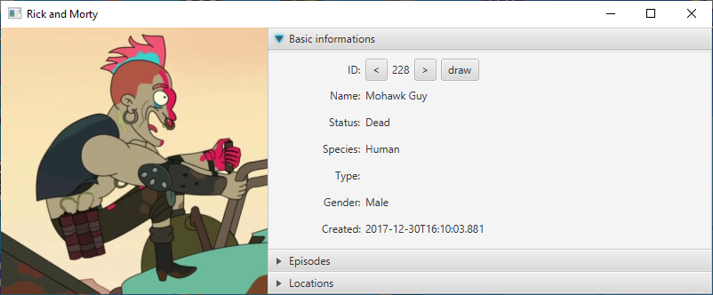
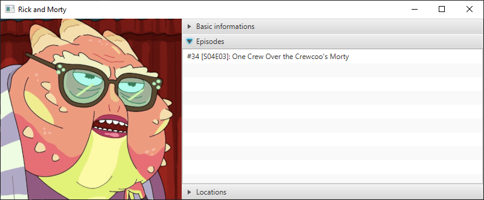
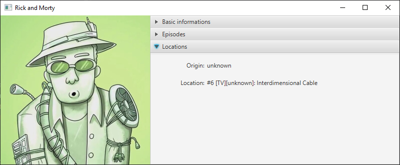

# Rick and Morty API – JavaFX GUI Client

## Screenshots

## Technologies

This project is built with the following technologies:

- **Java** – The primary programming language for the entire application
- **JavaFX** – Framework for building the graphical user interface (GUI) with rich desktop application features
- **Rick and Morty API** – External API used as the data source for character, episode, and location information
